Revision B of the risc-v core with DDR3 support, work in progress
This repository currently only houses the DDR3 controller test code

Recreating the memory controller IP for Arty S7-25

Prerequisite: Vivado 2020.2

- Go to IP Catalog in Vivado and double click the Memory Interface Generator (MIG 7 Series)

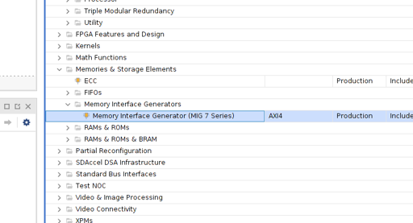

- Hit Next on the initial screen

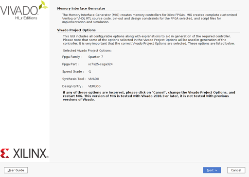

- Select Create Design on second page, make sure AXI4 Interface is unchecked, Next

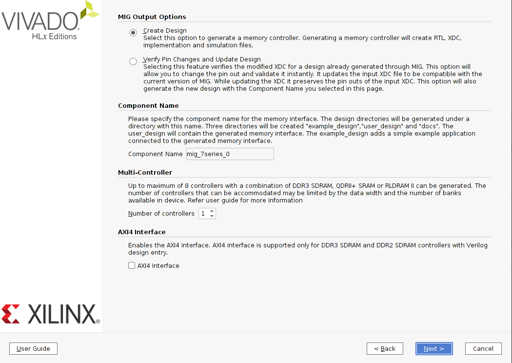

- Click the checkbox for your FPGA part (xc7s50-csga324 for Arty S7-25 board), Next

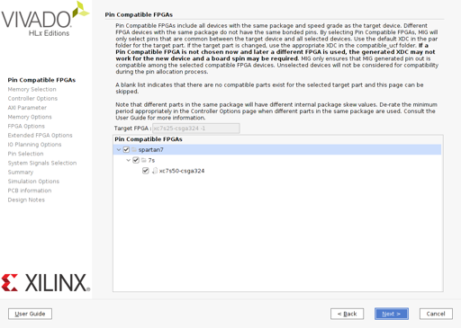

- Select DDR3 SDRAM, Next

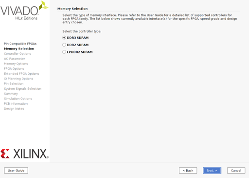

- On this screen, set Clock Period to 3.077ps, and the memory part MT41K128M166XX-15E, set Memory Voltage to 1.35V, adjust your data width to 8 (so that this sample works), keep data mask selected and keep ordering as Strict, Next

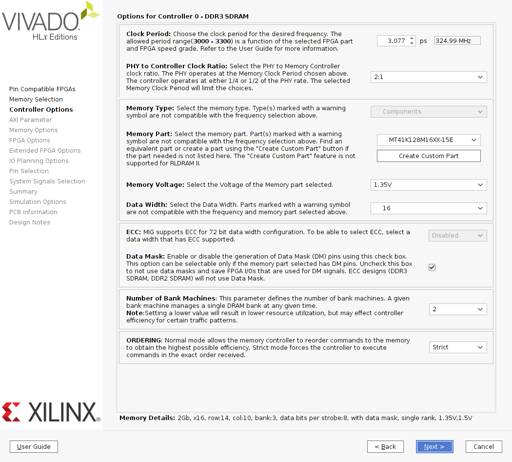

- For input clock period, make sure you select 10000ps (100Mhz), set Output Impedance and RTT to RZQ/6, and make sure Chip Select is enabled. For this example we use bank:row:column address mapping, so make sure that one is picked, Next

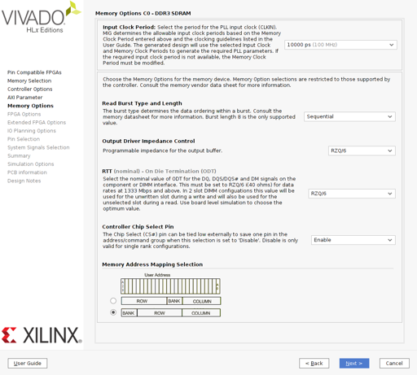

- Now the tricky bit. System Clock has to be set to Single-Ended, and Reference Clock has to be Unbuffered for the controller to sync properly (due to how we feed it clock signals), enable Internal Vref, and keep XADC Instantiation enabled, make sure System Reset Polarity is active low, Next

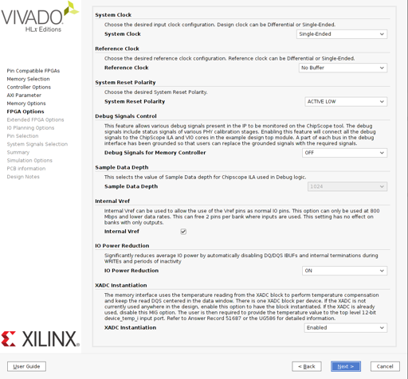

- Keep the termination impedance at 50 Ohms, Next

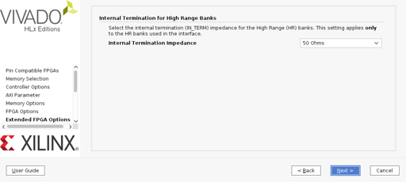

- Choose Fixed Pin Out, Next

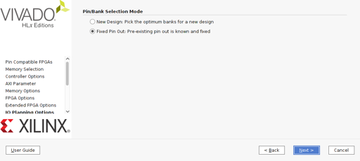

- Use Read XDC/UCF, pick the file 'migpinout.ucf' in the root directory of this project. Once it loads and populates the list, hit Validate, OK, then Next

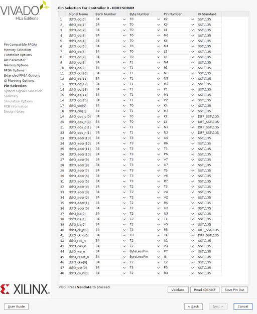

- sys_clk_i has to be tied to R2 pin, make sure you have bank 34/R2(SRCC_P) selected. Leave sys_rst, init_calib_complete, tg_compare_error as 'no connect' since we'll tie internal wires and not pins to these signals, Next

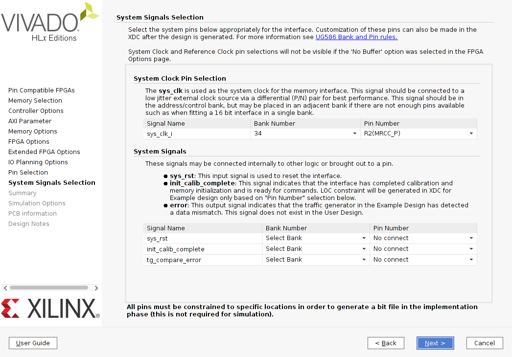

- Use next until you complete the rest of the information pages, and the memory controller IP will be generated

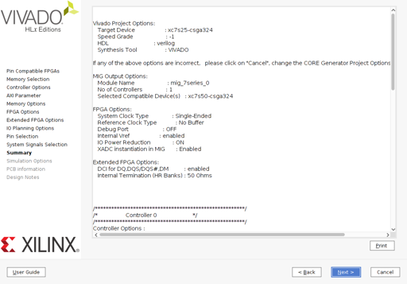

Please note that you need to pick 'Global' on the Generate Output Products page when presented. If you miss this, you can get back to it by right clicking on the mig_7series_0.xci and selecting the Generate Output Products menu option. Global synthesis is important as the Out Of Context synthesis generates outputs which do not satisfy timings (Worst Negative Slack < 0)
